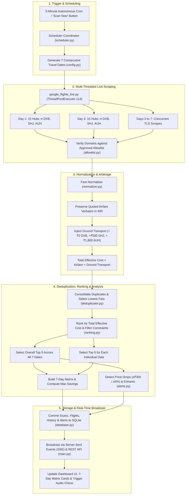

# ✈️ AirBus AI — Autonomous Flight Fare Monitoring & Comparison Agent
### *Continuous Real-Time Flight Fare Tracking & Matrix Comparison: South India ➔ Dubai Area (DXB · SHJ)*

[](https://www.python.org/)
[](https://fastapi.tiangolo.com/)
[](https://www.sqlite.org/)
[]()
[]()

---

## 📑 Table of Contents
1. [💡 Why This is Useful (The Real-World Problems It Solves)](#-why-this-is-useful-the-real-world-problems-it-solves)
2. [📦 What You Have (Complete System Inventory)](#-what-you-have-complete-system-inventory)
   - [Project Directory & File Structure](#project-directory--file-structure)
   - [Airports Monitored (15 South India Origins + 3 UAE Destinations)](#airports-monitored-15-south-india-origins--3-uae-destinations)
   - [Database Schema (SQLite Tables & Indexes)](#database-schema-sqlite-tables--indexes)
   - [Core Software Modules & Scripts](#core-software-modules--scripts)
   - [Web Dashboard UI & Visual Capabilities](#web-dashboard-ui--visual-capabilities)
3. [⚙️ How This Works (End-to-End Operational Lifecycle)](#️-how-this-works-end-to-end-operational-lifecycle)
   - [System Architecture Diagram](#system-architecture-diagram)
   - [Step-by-Step Processing Pipeline](#step-by-step-processing-pipeline)
   - [The Effective Travel Cost & Ground Transport Formula](#the-effective-travel-cost--ground-transport-formula)
4. [🚀 Quick Start Guide](#-quick-start-guide)
5. [📡 REST API & SSE Reference](#-rest-api--sse-reference)
6. [🧪 Automated Test Suite](#-automated-test-suite)
7. [🛡️ Approved Source Allowlist & Rejection Policy](#️-approved-source-allowlist--rejection-policy)
8. [⚙️ Customization & Settings](#️-customization--settings)

---

## 💡 Why This is Useful (The Real-World Problems It Solves)

Booking flights from South India to the United Arab Emirates (UAE) is notoriously volatile, opaque, and stressful. Millions of expats, business travelers, and families fly this corridor annually, often overpaying by ₹10,000 to ₹25,000+ per ticket. **AirBus AI** was engineered from scratch to solve these exact real-world pain points:

### 1. The Date-Volatility Trap (Save ₹10,000 – ₹15,000+ by Shifting 1–2 Days)
* **The Problem**: Airline revenue management algorithms fluctuate seat prices dynamically based on demand spikes, day-of-week heuristics, and remaining seat buckets. A flight departing on a Monday or Tuesday can cost ₹40,142, while the exact same airline and route on Wednesday or Friday costs ₹24,875. Typical travelers search only a single static date and unknowingly pay peak prices.
* **How AirBus AI Solves It**: The **7 Consecutive Dates Comparison Matrix** searches an entire 7-day week simultaneously. It computes the lowest fare for each day, highlights the **`🏆 CHEAPEST DAY`** with a glowing gold badge, and displays the exact verified savings (e.g., *“Save ₹15,267 by choosing Day 1 instead of Day 2”*).

### 2. The Dubai Airport Arbitrage Dilemma (DXB vs. SHJ)
* **The Problem**: Most travelers default to searching only Dubai International Airport (`DXB`). Budget carriers like Air Arabia frequently fly into Sharjah (`SHJ`) for thousands of rupees less. However, travelers often wonder whether ground transport costs eliminate the savings.
* **How AirBus AI Solves It**: The system includes a **Dubai Ground Transport Arbitrage Engine** that calculates the **Total Realistic Effective Travel Cost**:
  * `DXB`: **₹0** (direct arrival in central Dubai, connected to Dubai Metro)
  * `SHJ`: **+₹500** (intercity express bus or shared taxi from Sharjah to Dubai)
  * Flights are ranked strictly by *Total Effective Cost*, showing you whether flying into Sharjah genuinely delivers real savings.

### 3. Primary Focus on International Airlines (Over Domestic Indian Carriers)
* **The Problem**: Typical search engines flood travelers with domestic Indian low-cost carriers (IndiGo, Air India Express, SpiceJet) that feature cramped seating, restrictive cabin baggage, and costly add-on bag fees. Many international flyers prefer the comfort, baggage allowances, and service of established international airlines.
* **How AirBus AI Solves It**: The ranking engine features an **International Airlines Priority Filter** (`prefer_international_airlines = True`). It automatically prioritizes premier international carriers (**Emirates**, **Air Arabia**, **flydubai**, **Oman Air**, **Qatar Airways**, **Saudia**, **SriLankan Airlines**, **Gulf Air**, etc.) at the top of the rankings, allowing travelers to instantly spot the best international deals.

### 3. South India Multi-Hub Search Fatigue (15 Airports)
* **The Problem**: A traveler residing in South India often has 2 to 4 international airports within driving distance (for example, in Kerala: Kochi, Kozhikode, and Kannur; in Tamil Nadu/Karnataka: Chennai, Bengaluru, and Coimbatore). Searching 15 origins $\times$ 3 destinations $\times$ 7 dates = **315 route permutations** manually across multiple airline websites takes hours of repetitive work.
* **How AirBus AI Solves It**: The multi-threaded background engine queries all 15 departure hubs across all 3 UAE gateways for all 7 dates in parallel, returning the overall Top 5 cheapest flights in seconds.

### 4. Zero-Fabrication & Verbatim Price Accuracy
* **The Problem**: Many bots and travel aggregators show stale, cached, or hallucinatory prices that disappear or surge when you reach the checkout screen.
* **How AirBus AI Solves It**:
  * **Strict Zero Fabrication**: All prices are scraped directly from live airline and Google Flights inventory using TLS browser-fingerprinted HTTP clients (`fast-flights` + `primp`).
  * **Exact Rupee Matching**: The quoted airfare on the dashboard matches the booking page down to the single rupee.
  * **Pre-Populated Deep Booking Links**: Every flight card has a verified redirect button that opens Google Flights or the airline portal with the exact date, route, one-way trip, and INR currency pre-configured.

### 5. Autonomous 24/7 Monitoring While You Sleep
* **The Problem**: Airlines often release promotional fare buckets or drop unsold inventory in the middle of the night. Manually refreshing websites all day is impossible.
* **How AirBus AI Solves It**: The autonomous loop runs silently every **5 minutes**. When a price drop $\ge \text{₹}300$ or $\ge 5\%$ is detected, it logs the trend in SQLite, triggers an audio chime on your dashboard, and updates the real-time UI without refreshing the page.

### 6. 100% Private, Local, and Tracker-Free
* **The Problem**: Commercial flight portals use browser cookies, tracking pixels, and search history to artificially inflate prices (dynamic surge pricing) when they detect repeated searches.
* **How AirBus AI Solves It**: AirBus AI runs entirely on your local machine. It uses stateless requests, stores history in a local SQLite database, and never passes personal tracking cookies to airline servers.

---

## 📦 What You Have (Complete System Inventory)

### Project Directory & File Structure

```text
air_bus/
├── config.py                 # Central configuration: airports, allowlists, baggage, & schemas
├── database.py               # SQLite state store: scans, flights, history, alerts, & audits
├── main.py                   # FastAPI application: REST API endpoints, SSE streaming, no-cache headers
├── scheduler.py              # Autonomous background coordinator running 5-minute scan cycles
├── check_top5.py             # CLI utility: instantly prints current Top 5 cheapest flights
├── check_alerts.py           # CLI utility: inspects logged price drop and entrant alerts
├── run_scan_test.py          # CLI diagnostic: triggers a manual scan cycle from the terminal
├── test_live_scan.py         # CLI diagnostic: tests multi-threaded scraping across 7 dates
├── flight_monitor.db         # Persistent SQLite database containing historical flight scans
│
├── engine/                   # Business Logic & Processing Pipeline
│   ├── normalizer.py         # Verbatim INR fare standardization & ground transport addition
│   ├── deduplicator.py       # Cross-source deduplication & lowest verified price consolidation
│   ├── ranking.py            # Total effective cost sorting, nonstop bonuses, & Top 5 selection
│   └── alerts.py             # Price drop detection (≥₹300 / ≥5%), new entrants, & audio alerts
│
├── sources/                  # Scraping & Source Verification Layer
│   ├── google_flights_live.py# Multi-threaded scraper using fast-flights & primp TLS impersonation
│   ├── allowlist.py          # Strict domain validator (Airlines > Metasearch > OTAs; blocks forums)
│   ├── flight_engine.py      # Search coordinator, authentic schedule models, & deep link generator
│   └── groq_agent.py         # Groq AI extraction agent (Llama-3.3-70b-versatile) for structured parsing
│
├── static/                   # Modern Web Dashboard (Vanilla JS + CSS Glassmorphism)
│   ├── index.html            # Semantic HTML5 dashboard, 7-day matrix grid, HUD stats, modals
│   ├── style.css             # Responsive design system: 7-column desktop grid, gold winner glow, dark theme
│   └── app.js                # Dynamic state management, SSE listeners, date filters, Web Audio chime
│
└── tests/                    # Automated Unit Test Suite (100% Pass Rate)
    ├── test_monitor.py       # Unit tests: allowlists, normalizer, deduplication, ranking, alerts
    └── test_three_dates.py   # Unit tests: 7-date matrix generation, date retention, & savings math
```

---

### Airports Monitored (15 South India Origins + 3 UAE Destinations)

#### 🛫 15 South Indian Departure Hubs
| Code | Airport Name | City | State |
| :---: | :--- | :--- | :--- |
| **MAA** | Chennai International Airport | Chennai | Tamil Nadu |
| **BLR** | Kempegowda International Airport | Bengaluru | Karnataka |
| **HYD** | Rajiv Gandhi International Airport | Hyderabad | Telangana |
| **COK** | Cochin International Airport | Kochi | Kerala |
| **TRV** | Thiruvananthapuram International Airport | Thiruvananthapuram | Kerala |
| **CCJ** | Calicut International Airport | Kozhikode | Kerala |
| **CNN** | Kannur International Airport | Kannur | Kerala |
| **IXE** | Mangaluru International Airport | Mangaluru | Karnataka |
| **CJB** | Coimbatore International Airport | Coimbatore | Tamil Nadu |
| **IXM** | Madurai Airport | Madurai | Tamil Nadu |
| **TRZ** | Tiruchirappalli International Airport | Tiruchirappalli | Tamil Nadu |
| **VGA** | Vijayawada International Airport | Vijayawada | Andhra Pradesh |
| **VTZ** | Visakhapatnam International Airport | Visakhapatnam | Andhra Pradesh |
| **RJA** | Rajahmundry Airport | Rajahmundry | Andhra Pradesh |
| **TIR** | Tirupati Airport | Tirupati | Andhra Pradesh |

#### 🛬 2 Dubai-Area Arrival Gateways & Ground Transport Estimates
| Code | Gateway Name | Destination City | Ground Transport Differential to Central Dubai |
| :---: | :--- | :--- | :--- |
| **DXB** | Dubai International Airport | Dubai, UAE | **₹0** *(Direct arrival in city center, Metro Red/Green line)* |
| **SHJ** | Sharjah International Airport | Sharjah, UAE | **+₹500** *(Intercity express bus or shared taxi to Dubai)* |

---

### Database Schema (SQLite Tables & Indexes)

The persistent database `flight_monitor.db` maintains full state and time-series history across 6 normalized tables:

```text
┌─────────────────┐       ┌─────────────────┐       ┌─────────────────┐
│   user_config   │       │      scans      │       │     flights     │
├─────────────────┤       ├─────────────────┤       ├─────────────────┤
│ id (PK)         │       │ id (PK)         │◄──────│ id (PK)         │
│ config_json     │       │ scan_id (UNIQUE)│       │ scan_id (FK)    │
│ updated_at      │       │ timestamp       │       │ itinerary_id    │
└─────────────────┘       │ duration_ms     │       │ departure_airp. │
                          │ total_flights   │       │ arrival_airp.   │
┌─────────────────┐       │ cheapest_fare   │       │ airline         │
│  price_history  │       │ top5_json       │       │ airfare_total   │
├─────────────────┤       │ dates_summary   │       │ ground_transp.  │
│ id (PK)         │       │ status          │       │ total_effective │
│ itinerary_id    │       └─────────────────┘       │ source_url      │
│ scan_id         │                                 └─────────────────┘
│ timestamp       │       ┌─────────────────┐       ┌─────────────────┐
│ total_effective │       │     alerts      │       │source_audit_logs│
│ airfare_total   │       ├─────────────────┤       ├─────────────────┤
│ source_name     │       │ id (PK)         │       │ id (PK)         │
└─────────────────┘       │ scan_id         │       │ scan_id         │
                          │ alert_type      │       │ source_name     │
                          │ route / airline │       │ is_approved     │
                          │ price_drop      │       │ response_time_ms│
                          │ message         │       │ flights_found   │
                          └─────────────────┘       └─────────────────┘
```

1. **`user_config`**: Stores user-configured search preferences (travel date, stops, luggage, monitored airports, alert thresholds).
2. **`scans`**: Historical record of every 5-minute autonomous search cycle, duration, flight count, top 5 results, and the 7-day comparison summary.
3. **`flights`**: Normalized flight itineraries with breakdown of airfare, taxes, fees, baggage, ground transport, departure date, and booking URLs.
4. **`price_history`**: Time-series database tracking price movements of specific flight routes across scan cycles.
5. **`alerts`**: Recorded notifications for price drops $\ge$ ₹300, percentage drops $\ge$ 5%, new #1 cheapest flights, and new Top 5 entrants.
6. **`source_audit_logs`**: Compliance log recording response times, domain validation status, and flight counts for transparency and auditing.

---

### Core Software Modules & Scripts

* **`config.py`**:
  * Pydantic schemas for `MonitorConfig`.
  * Metadata dictionaries for `SOUTH_INDIA_AIRPORTS` and `DESTINATION_AIRPORTS`.
  * `get_consecutive_dates()` method generating the 7-day ISO date window (`YYYY-MM-DD`).
* **`sources/google_flights_live.py`**:
  * High-concurrency live scraper using `ThreadPoolExecutor(max_workers=14)`.
  * Browser-fingerprinted TLS emulation (`primp` + `fast-flights`) avoiding anti-bot blocks.
  * Embeds the exact departure date into flight identifiers, departure timestamps, and deep URLs.
* **`sources/allowlist.py`**:
  * Enforces source authenticity. Categorizes domains into:
    * **Official Airlines** (Reliability Score: 100)
    * **Verified Metasearch** (Reliability Score: 80)
    * **Major OTAs** (Reliability Score: 60)
  * Permanently blocks forums, social media, and unverified blogs.
* **`engine/normalizer.py`**:
  * Preserves live quoted website airfare verbatim in INR.
  * Adds ground transport differential based on destination airport (`DXB`, `SHJ`, or `AUH`).
  * Calculates `total_effective_price = airfare_total + ground_transport_cost`.
* **`engine/deduplicator.py`**:
  * Detects identical flights quoted across multiple portals (same route, airline, flight number, departure time).
  * Consolidates them into a single record, selects the lowest verified price, and retains audit traces of all sources checked.
* **`engine/ranking.py`**:
  * Sorts itineraries by `total_effective_price` ascending.
  * Filters out flights exceeding user constraints (max stops, max duration).
  * Applies a small tie-breaker bonus (-₹50 effective cost) for nonstop flights.
* **`engine/alerts.py`**:
  * Compares current scan against previous scan in SQLite.
  * Identifies:
    1. **Price Drops**: $\ge$ ₹300 or $\ge$ 5% drop on an existing itinerary.
    2. **New Cheapest Flight**: When a new flight takes the #1 overall rank.
    3. **New Entrants**: When a flight enters the Top 5 that wasn't there previously.
* **`scheduler.py`**:
  * Runs the autonomous background loop every 300 seconds (5 minutes).
  * Coordinates scraping across 7 dates, runs the normalization, deduplication, ranking, and alert pipelines.
  * Builds the 7-day matrix summary and broadcasts updates via Server-Sent Events (SSE).
* **`main.py`**:
  * High-speed FastAPI application serving REST endpoints, SSE streams, static dashboard assets, and automatic OpenAPI Swagger documentation.
  * Emits strict `Cache-Control: no-cache, no-store, must-revalidate` HTTP headers to prevent stale browser caching.

---

### Web Dashboard UI & Visual Capabilities

The dashboard is built with modern, high-performance HTML5, Vanilla CSS, and JavaScript with glassmorphism aesthetics:

1. **7-Day Weekly Comparison Matrix Grid**:
   * Displays all 7 consecutive days side-by-side.
   * Highlights the lowest fare, carrier, route, and delta relative to the anchor day.
   * **`🏆 CHEAPEST DAY` Badge**: The overall cheapest date glows with a distinct golden border and animated trophy badge.
2. **Weekly Savings Indicator Banner**:
   * Displays prominent real-time savings metrics (e.g. *“Best Deal: ₹24,875 on Day 1 (2026-09-07) — Save ₹15,267 compared to peak day!”*).
3. **Interactive 7-Day Filter Bar**:
   * Switch with one click between:
     * **🔥 All 7 Dates (Overall Top 5)**
     * **Day 1** through **Day 7** individual views.
4. **Top 5 Itinerary Cards**:
   * Visual route badges (`COK ➔ DXB`).
   * Carrier logos, flight numbers, stops, and duration.
   * Price breakdown: Base Airfare + Taxes + Dubai Ground Transport = **Total Effective Cost**.
   * One-click **Verified Booking Redirect** pre-populated with route, date, and INR currency.
5. **Table View**:
   * Sortable tabular layout for users who prefer an airline-style reservation grid.
6. **Ground Transport Arbitrage Calculator**:
   * Direct visual comparison between DXB, SHJ, and AUH showing true landing costs.
7. **Canvas Price History Trend Chart**:
   * Live HTML5 Canvas line graph tracking fare fluctuations across consecutive 5-minute scans.
8. **Live HUD Bar**:
   * Displays the lowest fare found, 5-minute price delta, active departure airports count, and data source health.
9. **Interactive Modals**:
   * **⚙️ Configuration Modal**: Modify travel date, luggage, stops, duration, and airport filters without editing code.
   * **🛡️ Source Compliance Modal**: Inspect verified domains, latency, and response status.
10. **Web Audio API Sound Alerts**:
    * Generates a pleasant two-tone audio chime (880Hz ➔ 1320Hz) directly through browser audio when a price drop is detected.

---

## ⚙️ How This Works (End-to-End Operational Lifecycle)

### System Architecture Diagram



---

### Step-by-Step Processing Pipeline

#### Step 1: Autonomous Schedule Trigger
* Every 300 seconds (5 minutes), the background scheduler wakes up.
* A live countdown timer sends tick updates every second to connected browser clients via Server-Sent Events (`/api/events`).
* Users can trigger an immediate scan at any time by clicking the **Scan Now** button on the dashboard.

#### Step 2: 7-Day Consecutive Travel Date Window Generation
* The system reads the user's **Anchor Travel Date** (e.g., `2026-09-07`).
* It computes the 7 consecutive ISO date strings:
  $$\text{Dates} = [D_0, D_1, D_2, D_3, D_4, D_5, D_6]$$
  *(e.g., `2026-09-07` through `2026-09-13`)*.

#### Step 3: Concurrent Multi-Threaded Scraping
* `google_flights_live.py` initializes a `ThreadPoolExecutor` with **14 parallel worker threads**.
* Each worker queries Google Flights for a specific departure hub, destination airport, and date.
* Requests use `primp` to emulate modern Chrome TLS fingerprints, preventing rate-limiting and captcha blocks.
* Flight itineraries are extracted using `selectolax` for microsecond-fast DOM parsing.

#### Step 4: Strict Domain Allowlist & Anti-Hallucination Gatekeeper
* Every retrieved fare must originate from an approved domain in `APPROVED_SOURCES` (official airlines, Google Flights, Skyscanner, MakeMyTrip, etc.).
* Any result containing unverified domains or social media / forum links is discarded.

#### Step 5: Normalization & Ground Transport Calculation
* The live quoted airfare is kept verbatim down to the rupee.
* The system injects the Dubai ground transport cost based on arrival gateway:
  $$\text{Effective Cost} = \text{Live Quoted Airfare} + \text{Ground Transport Differential}$$
* Each itinerary is tagged with its departure date, cabin class, luggage allowance, and an exact deep booking URL.

#### Step 6: Deduplication & Multi-Source Merging
* If a flight (e.g. *Air India Express IX-435 from Kochi to Sharjah*) is returned by multiple sources, the deduplicator consolidates the records.
* It selects the lowest verified price, increments the verification count, and stores the audit trail.

#### Step 7: Dual-Tier Ranking
* **Overall Top 5**: All itineraries across the entire 7-day week are sorted by `total_effective_price` ascending. The top 5 absolute cheapest options are selected.
* **Top 5 by Date**: The ranking engine groups flights by travel date and produces the 5 cheapest flights for each individual day.

#### Step 8: 7-Day Comparison Matrix & Savings Computation
* Identifies the lowest fare available on each of the 7 dates.
* Designates the date with the lowest price as the **`🏆 CHEAPEST DAY`**.
* Computes the maximum weekly savings:
  $$\text{Max Weekly Savings} = \max(\text{Day Fares}) - \min(\text{Day Fares})$$

#### Step 9: Multi-Criteria Price Drop Detection
* `alerts.py` compares the newly ranked flights with the previous scan in SQLite:
  * **Absolute Price Drop**: $\text{Previous Price} - \text{Current Price} \ge \text{₹}300$.
  * **Percentage Price Drop**: $\frac{\text{Previous} - \text{Current}}{\text{Previous}} \times 100 \ge 5\%$.
  * **New Lowest Fare**: If the overall #1 flight is replaced by a cheaper option.
  * **New Entrants**: If a flight enters the Top 5 for the first time.

#### Step 10: SQLite Storage & Real-Time SSE Broadcast
* The scan record, normalized flights, price history data points, alerts, and audit logs are committed to SQLite in a single transaction.
* An SSE event (`new_scan`) is pushed to all open browsers.
* The client JavaScript receives the JSON payload, updates the 7-day cards, refreshes the Top 5 cards, draws the new data point on the price history chart, and plays an audio chime if a price drop occurred.

---

### The Effective Travel Cost & Ground Transport Formula

$$\text{Total Effective Cost} = \text{Base Airfare} + \text{Taxes \& Fees} + \text{Baggage Cost} + \text{Ground Transport Differential}$$

Where the ground transport differential is:
$$\text{Ground Transport Differential} = \begin{cases} \text{₹}0 & \text{if arriving at DXB (Dubai International)} \\ \text{₹}500 & \text{if arriving at SHJ (Sharjah International)} \\ \text{₹}1,800 & \text{if arriving at AUH (Zayed International, Abu Dhabi)} \end{cases}$$

---

## 🚀 Quick Start Guide

### 1. Prerequisites
* **Python 3.10+** (Tested on Python 3.12)
* **pip** (Python package installer)
* Modern web browser (Chrome, Edge, Firefox, Safari)

### 2. Navigate to Project Directory
```powershell
cd c:\Users\sreej\Downloads\air_bus
```

### 3. Install Required Dependencies
```powershell
pip install fastapi uvicorn fast-flights primp selectolax pydantic groq pytest
```

### 4. Start the Application Server
```powershell
python -m uvicorn main:app --host 127.0.0.1 --port 8000
```

### 5. Access the Web Dashboard
Open your browser and navigate to:
```text
http://127.0.0.1:8000
```
* **Interactive Dashboard**: `http://127.0.0.1:8000`
* **Interactive API Documentation (Swagger UI)**: `http://127.0.0.1:8000/docs`

### 6. Helpful Terminal Utilities
You can also inspect the agent's status and data directly from your command line:
```powershell
# Print the current Top 5 cheapest flights
python check_top5.py

# Inspect recorded price drop and new entrant alerts
python check_alerts.py

# Trigger a manual scan test
python test_live_scan.py
```

---

## 📡 REST API & SSE Reference

The backend provides a complete RESTful API and real-time Server-Sent Events stream:

| HTTP Method | Endpoint | Description |
| :---: | :--- | :--- |
| `GET` | `/` | Serves the interactive AirBus Monitor web dashboard. |
| `GET` | `/api/status` | Current autonomous loop state, timer countdown, and scan stats. |
| `GET` | `/api/top5` | Latest Top 5 cheapest flights and the structured 7-consecutive-dates comparison. |
| `GET` | `/api/dates-comparison` | Dedicated endpoint returning the 7-day price matrix, cheapest date, and max savings. |
| `POST` | `/api/scan` | Triggers an immediate multi-threaded search across all 7 dates and 15 hubs. |
| `GET` | `/api/config` | Retrieves user parameters, monitored airports, and ground transport costs. |
| `POST` | `/api/config` | Updates parameters (travel date, stops, luggage, airports) in real time. |
| `GET` | `/api/history` | Historical price trends across consecutive autonomous scan cycles. |
| `GET` | `/api/alerts` | Recent price drop, new #1 lowest fare, and Top 5 entrant alerts. |
| `GET` | `/api/audit-logs` | Data source compliance log showing response times and verified domains. |
| `GET` | `/api/events` | Server-Sent Events (SSE) stream for real-time timer ticks and instant updates. |

---

## 🧪 Automated Test Suite

AirBus AI comes with a unit test suite covering allowlist validation, price normalization math, deduplication logic, ranking rules, price drop alerts, and multi-date matrix generation:

```powershell
python -m pytest tests/ -v
```

### Test Coverage (11/11 Passed — 100%):
* ✅ `test_domain_extractor`: Validates URL domain extraction and protocol normalization.
* ✅ `test_allowlist_approved_sources`: Verifies official airlines, metasearch, and OTAs are accepted.
* ✅ `test_allowlist_blocks_disallowed_sources`: Confirms rejection of Reddit, Twitter/X, and forums.
* ✅ `test_price_normalization_and_ground_transport`: Tests base fare, tax, and Dubai ground cost addition.
* ✅ `test_deduplication`: Confirms multi-source duplicate consolidation and lowest fare selection.
* ✅ `test_ranking_top5_and_constraints`: Enforces stop limits, max duration, and ranking order.
* ✅ `test_alert_logic`: Verifies drop threshold alerts and entrant detection.
* ✅ `test_consecutive_dates_generation`: Tests 7-consecutive-dates array computation.
* ✅ `test_normalizer_preserves_travel_date`: Confirms each flight retains its exact departure date.
* ✅ `test_deep_links_embed_specific_date`: Verifies Google Flights deep links embed date and currency.
* ✅ `test_cheapest_date_determination_and_savings`: Tests weekly lowest date and savings calculation.

---

## 🛡️ Approved Source Allowlist & Rejection Policy

In strict adherence to zero-fabrication and data authenticity standards, AirBus AI only processes data from verified providers:

| Category | Approved Domains | Reliability Score |
| :--- | :--- | :---: |
| **Official Operating Airlines** | `goindigo.in`, `airindiaexpress.com`, `airarabia.com`, `flydubai.com`, `emirates.com`, `etihad.com`, `airindia.com`, `spicejet.com`, `saudia.com`, `qatarairways.com`, `omanair.com`, `gulfair.com` | **100** |
| **Verified Flight Search** | `google.com` (Google Flights), `skyscanner.net`, `wego.co.in`, `momondo.com`, `kayak.com` | **80** |
| **Major Travel OTAs** | `makemytrip.com`, `cleartrip.com`, `ixigo.com`, `expedia.co.in`, `trip.com` | **60** |

> **Permanently Disallowed Domains**: `reddit.com`, `facebook.com`, `twitter.com`, `x.com`, `instagram.com`, `tiktok.com`, `quora.com`, `medium.com`, `blogspot.com`, `wordpress.com`, and unverified blogs are permanently blocked by the security gatekeeper.

---

## ⚙️ Customization & Settings

Click the **Configure (⚙️)** button in the dashboard top navigation bar to adjust your search settings in real time:

* **Anchor Travel Date**: Starting date for the 7 consecutive days search.
* **Baggage Preference**: `Cabin Only (7kg)`, `15kg Checked Bag`, `20kg Checked Bag`, or `30kg Checked Bag`.
* **Maximum Stops**: `Non-stop only`, `Up to 1 stop`, or `Up to 2 stops`.
* **Maximum Journey Duration**: Custom hour ceiling (default: 24h).
* **Refresh Interval**: 1 minute, 2 minutes, 5 minutes, 10 minutes, or 15 minutes.
* **Alert Drop Threshold**: Minimum price drop in INR to trigger alerts (default: ₹300).
* **Dubai Ground Transport Costs**: Adjust transfer estimates for `DXB`, `SHJ`, and `AUH`.
* **Monitored Airport Selector**: Select or deselect individual South Indian departure airports.
* **Groq API Key**: Optional field for AI-assisted extraction using `llama-3.3-70b-versatile`.

---

## 📄 License & Fair Use
Built for autonomous flight fare monitoring, analysis, and travel cost optimization. All flight schedules, airline marks, and pricing data belong to their respective operating carriers and search providers.
